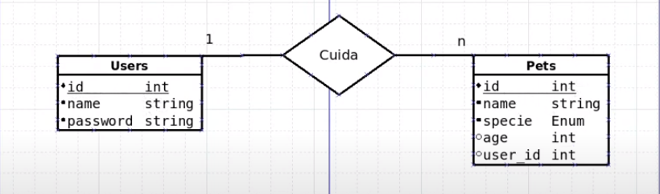
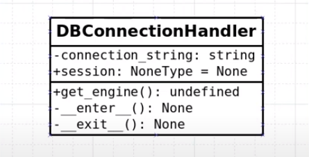

# Objetivo

Este projeto tem por objetivo praticar a clean architecture através da reprodução manual de um projeto apresentado na playlist [Clean Architecture Python](https://www.youtube.com/playlist?list=PLAgbpJQADBGJmTxeRZKWvdJAoJj8_x3si) do canal [Programador Lhama](https://www.youtube.com/c/ProgramadorLhama). 

Copiar projetos de pessoas que sabem mais que você ajuda na evoluação pessoal.

# Diagramas

Tabelas em nosso DB:

Nossa classe DB:

